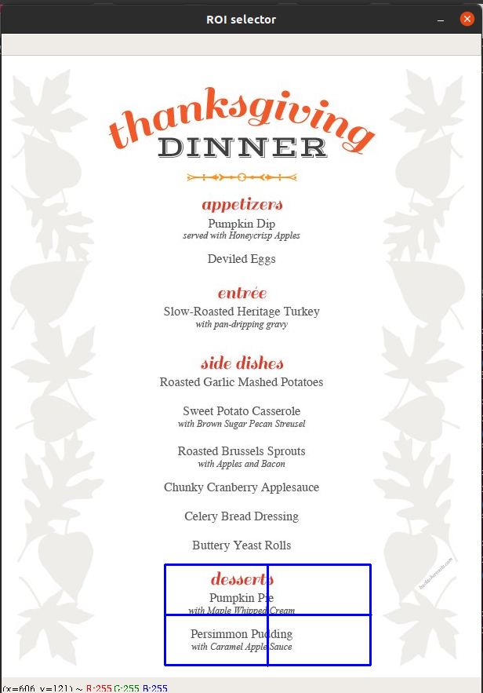
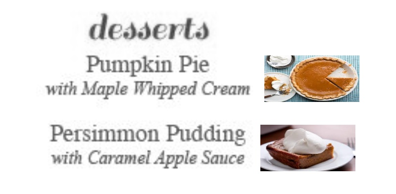

# Restaurant Menu Expert

We have developed user friendly system that translates the text of english restaurant menus into pictures of the corresponding dishes.Users are asked to take picture of menu and to crop and select the desired dish text which then processed by the proposed pipeline and displayed back with dish images along with dish names.
___
##### Python Implementation of [Restaurant Menu Expert](https://web.stanford.edu/class/ee368/Project_Autumn_1516/Reports/Wang_Chen_Lang.pdf)
___ 
### Directory Structure
```
├── Documentation.md
├── README.md
├── documents : 
    ├── Presentations for mid & final evaluation 
├── images : Images for markdown files
├── img : 
    ├── menu_items : Contains images of dishes 
    ├── Sample Menu Images
├── output : Folder contains output of the program
├── src : 
    ├── Menu.ipynb : Assembled python notebook of main Class of Restaurant menu expert
    ├── examples.ipynb : Tested examples with 
    ├── main_class.ipynb 
    ├── performance_measures.ipynb : Performance Plots
    ├── test.ipynb : Initlia piecewise implementation of pipeline 
    ├── restaurant_menu.py : contains final implementation of the class 
    ├── main.py :  Driver Script that import restaurant_menu class and runs the pipeline with parameters given in command line argument 
```
___
### Requirements
- Python 3
- OpenCV 2.0
- Numpy
- Matplotlib
- Scikit-image 0.17.1
- Pillow 2.2.1
- Pytesseract 0.3.6

Development is done on Linux Environment 
___

### Running The Code

#### Setup
- Clone The Repository
- Install All The Requirements
- Put the dish images inside the **menu_items** folder in **img**
- Install tesseract-ocr
```sh
        $ sudo apt-get install tesseract-ocr
```

#### Running Script
- Run the script 'main.py' in src with arguments , image path and maximum allowed edit distance  
```sh
        $ python3 main.py <img_path> <max_dist>
```
- Example :
```sh
        $ python3 main.py --img_path ../img/test.jpg --max_dist 4
```

#### Things to take care of
- Press Enter 2 Times After selection of ROI From image , otherwise it will generates error
- Put all the disk images that you want to visualize in the menu_item folder with .jpeg extension
- Names of dish images must be same as written in the menu
- Don't choose dish images that are very large or small. It may cause stretching or compression of the dish image in output  
- Choose clean menu Images that don't have much noise or not blurred 
___
#### Output






