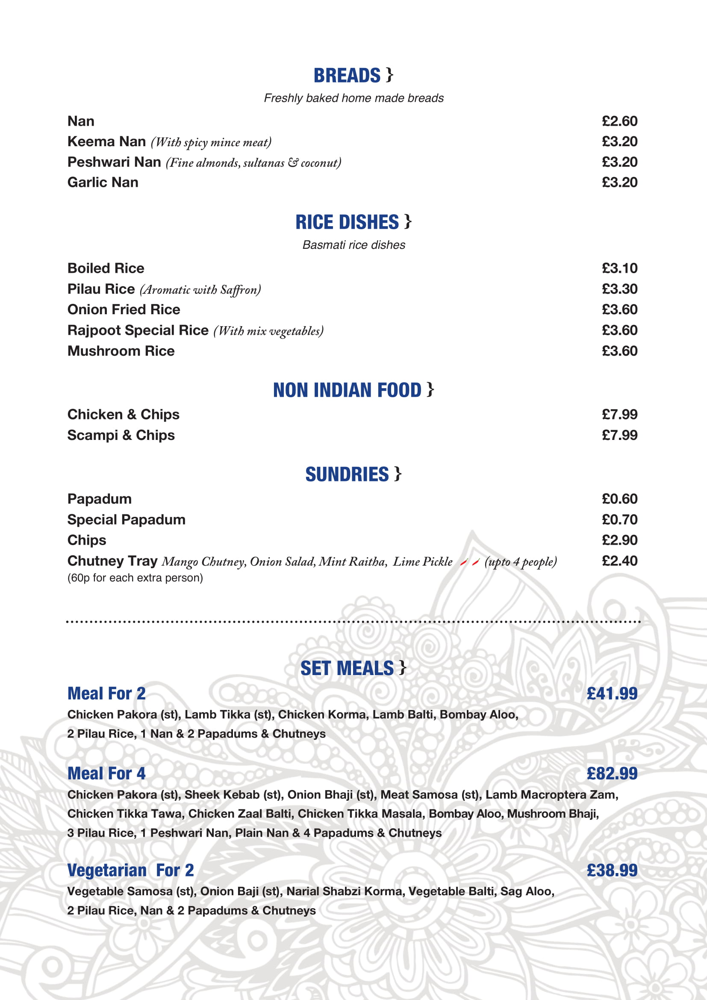
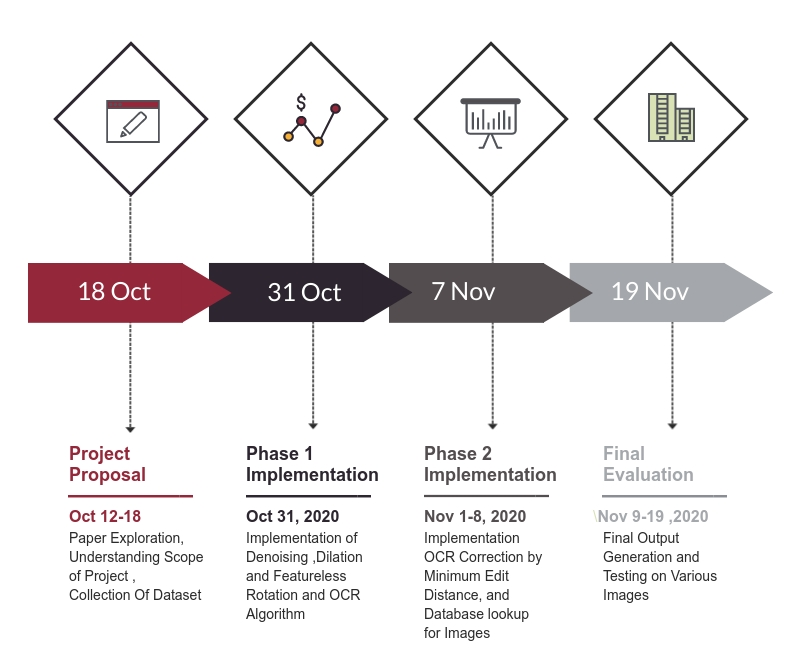

# Restaurant Menu Expert 

#### Project Code: [Github Link](https://github.com/Digital-Image-Processing-IIITH/project-team-7 "Github Link")

##### Team Name: Team 7

##### Team Members

- Tirth Pandit (2019201017)
- Jay Krishna (2019201019)
- Smit Khanpara (2019201021)
- Pratik Tiwari (2019201023)
- Dharmesh Gusai (2019201025)

------------

#### Project Goals

- Often people are unfamiliar with the names of dishes on the menu While visiting restaurants.  This is quite natural due to differences between languages and traditions.
- So, In this project, we will try to implement the methodology through which one can see the image of the dish on the side of the original dish name on the menu.
- User Have to capture the image of menu through the camera enabled device. Which then feed to the program that executes our algorithm on the image of menu and generates output containing the same menu with dish images are shown along with their dish names.
- This helps to visualize the dish and making order which suites best to the user. 

------------

#### Problem definition

In this project, Our Main Target is to tackle the problem of identifying dish names in menus and provide useful images and text according to it, such as an example picture of the dish or the translated dish name.

We will try to achieve the target by implementation of  several image processing techniques including denoising, Dilation and rotations.

Second part contains the character recognition which can be achieved through well known OCR(Optical Character Recognition) Algorithm. 

Also we will try to emphasize to correct the errors generated in OCR Phase and try to resolve mismatched characters within a word within reasonable time latency such that it can perform well in real time setups.

Once the Characters are recognized in digital form , program will search for that dish in the local database having mapping of name of dishes and its associated image. So program will fetch the image and display it with name of dish.

------

#### Results of the project

1. Capture the input image of a menu, first apply denoising, sharpness enhancement
   and thresholding to obtain a binary image of menu.

2. Then we will apply Featureless Rotation .

3. OCR Algorithm To recognize the words. 

4. Implement commonly used natural language processing techniques, such as shortest
   Levenshtein distance, to resolve mismatched characters within a word.

5. Identify the image for the dish from the local database.

6. Display the image on the menu.

   ------

   #### Project milestones and expected timeline

   

------

#### Dataset

We will require dataset of restaurant menu images to show and verify our results. We plan to scrape it from internet.
